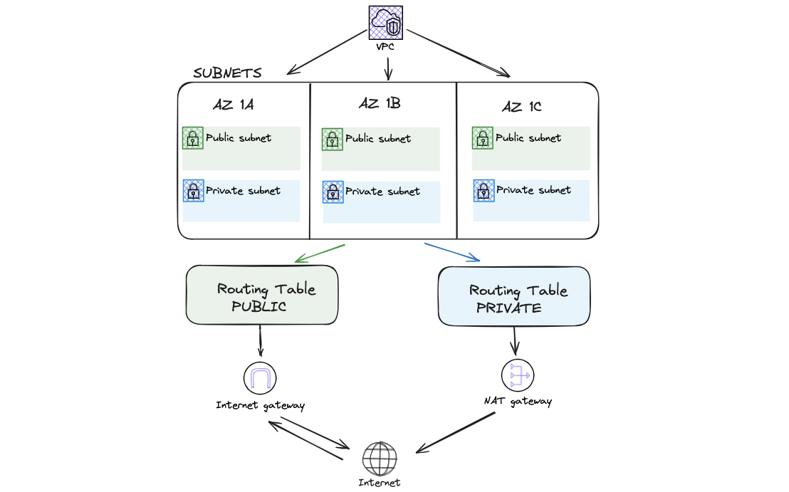

# Terraform EKS Infrastructure
---
## Description and Architectures
This is a Terraform configuration for an HA (High Availability) EKS infrastructure .
In this configuration will be created the following resources in the Cloud provider AWS:
- **1 EKS cluster** (with control plane and worker nodes)  
- **1 VPC** with all resource necessaries for networking
    - **3 Public Subnets**
    - **3 Private Subnets**
    - **1 Internet Gateway**
    - **1 Nat Gateway** (for private subnets)
    - **2 Route Tables**
- Several **IAM Roles** for permission control

This infrastructure can host several high scaling microservices taking into account the following concerns:
- **Business Continuity**
    EKS is the managed Kubernetes controlplane by AWS. It contains only master nodes and the kubernetes API; the microservices are hosted in the worker nodes which are connected and registered to controlplanea and distributed into 3 AZs (eu-west-1a, eu-west-1b, eu-west-1c). 
    
    

    As an infrastructure orchestrator EKS is responsible for the autoscaling of the worker nodes (up and down).
    The EKS service is responsible for the autoscaling of the worker nodes managed by NodeGroups objects and released on EC2 instances. The key component for the autoscaling is the kubernetes agent cluster-autoscaler that monitors the utilization state of the worker nodes and scales up and down based on the collected metrics in collaboration with the NodeGroup component managed by AWS. The possibility to have multiple instances of worker nodes make the cluster more consistence to fault tollerance and other types of incident that could reduce the availability of the workloads hosted in the cluster. 
    To harden business continuity the worker nodes are deployed in multiple Availability Zones to reduce problems tied to cloud infrastructure faults or eventual cloud provider mainteinance periods that cloud shutdown the EC2 instances interested.

    

     In conclusion, to reduce network bottleneck or resource failure due to network saturations, the ingress is configured to be installed with the Elastic Load Balancer service; that automatically scales the proxy load balancer in front of the cluster, based on the density of traffic received.
- **Security**
    The Security on this infrastructure starts from the networking module using a private subnet for the worker nodes and a security group that protect them from external access (only control pane and ingress can reach them).
        Consideration: In this configuration there is the assumption that the workloads contained in the worker nodes needs an internet connection (for example for a external DB saving or pulling container from the remote repository); so there is the need of a NAT Gateway. If we want to harden the security of the cluster just remove the nat gateway; in this way the workload are isolated from internet but on the other side they don't have any internet access (it also reduces infrastructure costs).
    The only resources that can be attached to the public subnet are the loadbalancer, responsible for the cluster ingress and/or kubernetes API Endpoint (if there are not virtualizing tools like vpn to access the private network from the outside, otherwise the K8s  API can be installed in private subnet )
    The SecurityGroups are configured singularly for eks controlplane and worker nodes; 
        - the controlplane security group protect the controlplane managing the rules for communication between worker nodes and control plane. It only accept ingress traffic on 443 port from worker nodes for Kubernetes API calls and egress on port 10250 to worker nodes for communications between controlplane and each worker node's kubelet agent.
        - the worker node security group protect the worloads (microservices) hosted in the worker nodes, controlling the inbound and outbound traffic avoiding communication from unauthorized sources. It accept inbound traffic on port 10250 from the controlplane and on 65535 for node-to-node communication (microservices distributed communications); and outbound traffic for node-to-node communication and also to the nat gateway for Internet access
    Another security aspect is the use of AWS KMS service for store kubernetes secrets encrypted. This service is attached to EKS in the configuration so during communications between controlplane and worker nodes secrets are exchanged automatically.
    The resources such as controlplane service and workernodes instance are configured to have their specific IAM role to limit privileges at minimum risk as possibile. In this configuration is applied the template to give less privileges as possible to service to reduce security risks. All cluster interaction with the other AWS services are managed. 
    The controlplane role has attached policy to perform:
        - cluster monitoring and auditing trough the access to CloudWatch
        - vpc resources management strictly tied to the cluster environment (can not create resource outside the cluster domain)
        - cluster resource management like schedule new node scale up
    The worker nodes are enabled to do the following actions:
        - manage network resources for infra-cluster communications
        - schedule volumes to storage service and attach them to nodes 
        - read-only access to the elastic container registry to pull container images
    Also the accessibility to the cluster by users and services is secured by the use of OIDC authentication protocol attached to eks controlplane, so the users and services registered in IAM service can access the cluster information and operation only if they are enabled (RoleBaseAccessControl mechanism).
- **Monitoring & auditing**
    To scrape monitor metrics and audit logs in the cluster is deployed the prometheus metrics stack (Prometheus+Grafana) and the ELK Stack (Elastic + Kibana + Logstash + Filebeat) for logging
    Consideration: This technological choice its taken considering services costs and powerfulness. The simple choice cloud be to install the Cloudwatch agent natively integrated in the EKS service but it has a service cost directly proportional to the number of metrics scraped and volume of logs stored, also it has less customization/personalization. Both the Prometheus and Elastic are opensources products (no additional costs) and offers more personalization during the configurations of the workloads and UI dashboards.

The project structure observe the following terraform template for configurations:

```
teraform-eks-infrastructure/
.
├── README.md            
├── modules                 //modules directory for code isolation & organization
│   ├── k8s                 //k8s module directory
│   │   ├── main.tf         //k8s manifest
│   │   ├── outputs.tf      //k8s output declarations
│   │   └── variables.tf    //k8s variable declarations
│   ├── eks                 //eks module directory
│   │   ├── main.tf         //eks manifest
│   │   ├── outputs.tf      //eks output declarations
│   │   └── variables.tf    //eks variable declarations
│   └── network             //network module directory
│       ├── main.tf         //network manifest
│       ├── outputs.tf      //network output declarations
│       └── variables.tf    //network variable declarations
├── main.tf                 //main terraform file (root manifest)
├── outputs.tf              //main output manifest
├── sample.tfvars           //sample of variables population
├── versions.tf             //version of terraform and providers
└── variables.tf            //main variable declaration manifest
```
The configurations are organized into modules to isolate the the installation processes and to group all the resources that refers to the same macro-component (es network or eks cluster)

---
## Installation and Usage

To build the infrastructure and deploy all the resources simply launch the script:
>./install.sh

To deploy The monitoring and auditing services launch the script:
>./monitoring.sh

To access to the Prometheus dashboard launch the command below:
>kubectl port-forward prometheus-kube-prometheus-stack-prometheus-0 9090

Then connect to the local endpoint on your machine
<http://locahost:9090>

To access to the Prometheus dashboard launch the command below:
> kubectl port-forward svc/grafana 3000:80 

Then connect to the local endpoint on your machine
<http://locahost:3000>

To access to the Elastic dashboard launch the command below:
> kubectl port-forward service/quickstart-es-http 9200

Then connect to the local endpoint on your machine
<http://locahost:9200>

To access to the Kibana dashboard launch the command below:
> kubectl port-forward service/quickstart-kb-http 5601

Then connect to the local endpoint on your machine
<http://locahost:5601>